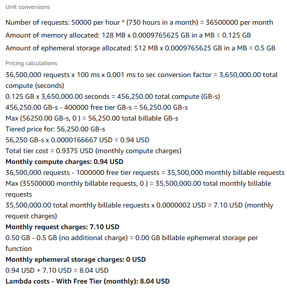
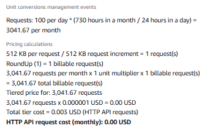

## Known metrics
#### Cost envelope
- Test method: AWS calculator for API Gateway + Lambda at target RPS; add 30% buffer
- Accept: Free for normal load (100 requests per day), ≤$0.01/h for viral spikes (50,000 requests per hour)
- Result: Free for normal load, and $0.012 per 10K requests that goes beyond the free 1 million a month.

### Lambda vs Fargate vs EC2

Lambda is free for normal load, and can take up to 1 million requests for free every month - that's about 20 hours of constant virality (50,000 requests per hour), which is a rare event. This is pretty good compared to Fargate with a fixed cost of $0.03/mo, and EC2 with $1.51/mo.

Lambda cost

AWS pricing calculator, normal load stays in free tier

AWS pricing calculator, free for 1 million requests per month and costs $0.0000002/req beyond that. That's about $0.002 per 10K requests going beyond the free tier.

Fargate cost

AWS pricing calculator, normal load costs $0.03/mo.

AWS pricing calculator, viral spike costs $0.03/mo - same price.

EC2 cost

AWS pricing calculator, normal load, cheapest type, costs $1.31/mo. Already more expensive than Fargate, so rule this out.

### API Gateway cost
Free for normal load and $0.05/h when a viral spike happens. CloudFront was considered for its cheap price (1TB + 10 million requests free) but it doesn't natively handle API concerns (auth, input validation, throttling). So, I chose API Gateway.

API Gateway cost

AWS pricing calculator, normal load stays in free tier

AWS pricing calculator, free for 1 million requests per month and costs $0.000001/req beyond that. That's about $0.01 per 10K requests going beyond the free tier.

## To be tested

#### SLA
- Test method: Synthetic probes (e.g., k6/Artillery) + CloudWatch p95 latency metric. 
- Accept: p95 < 100 ms under normal load (100 requests per day); < 1s under spike (50,000 requests per hour)

#### Baseline beats trivial:
- Test method: on a 1k-row sample, compare:  
    - Trivial baseline: always predict HowLongToBeat.com global average.  
    - Rule baseline: collaborative filtering model (matrix factorization or KNN).
    - Compute MAE and RMSE.
- Accept: model baseline improves MAE by ≥ 15% over global average.

#### No leakage:
- Test method: Feature timeline check. Ensure all training features (user’s past playtimes, game metadata) are available before prediction time. Exclude fields like “completion_time” for the target game.
- Accept: 0 features sourced from post-prediction data.

#### Privacy guardrails: k-anonymity
- Test method: Make requests for games with varying numbers of completion times recorded, check response
- Accept: Requests for games with k<10 completion time aggregates return a bucketed range, and games with k≥10 return an integer