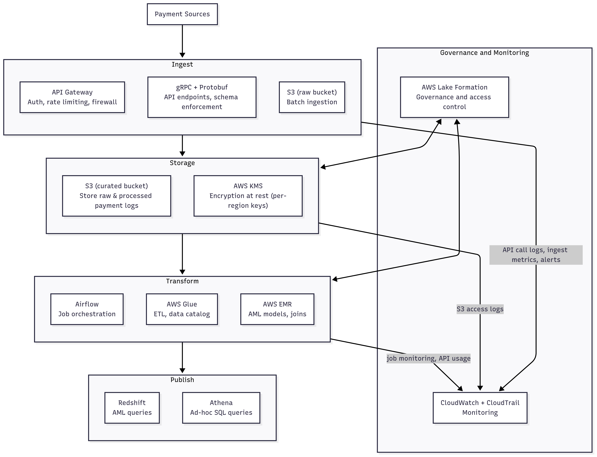

# Financial Transaction Monitoring
Batch pipeline, daily 2 TB of payment logs from banks and fintech companies across Canada and India. Overall, each layer of the pipeline keeps its operations to its jurisdiction, and data that crosses borders are anonymized and/or aggregated. Guardrails ensure complete, immutable accounts of logs compliant with privacy and security requirements. System is vigilant in checking failures in delivery and access as well as detecting anomalies.

## Architecture Diagram

<strong>Per-layer details</strong>

### Ingest Layer

Goal: Securely collect 2 TB/day of payment logs from Canada, India, UK.  
- S3/Blob ingestion endpoints per region (Canada/India/UK)
- Kafka / Kinesis / PubSub for streaming as an option if some logs arrive continuously.
- TLS + mutual authentication for API endpoints
- Region-specific ingress to enforce data sovereignty

### Storage Layer

Goal: Store raw logs securely for batch processing, compliant with retention requirements.  
- S3 data lakes per jurisdiction
- Encryption at rest: KMS-managed keys, region-specific
- Access controls: Role-based access to prevent cross-jurisdiction leakage
- Retention rules: Apply per country (e.g., Canada 7 years, India 5 years, UK 6 years)

### Transform Layer

Goal: Normalize, enrich, anonymize, and generate AML insights from the raw logs.  
Compute: Cloud-managed Spark / Databricks / EMR / Dataflow jobs per region 

Steps:
1. Validation & cleaning
2. Jurisdiction-aware transformations  
   Mask PII for unbanked populations, currency conversion, flag suspicious patterns
3. Aggregation / analytics
4. Metadata tagging (source country, retention deadline)

### Publish / Reporting Layer

Goal: Deliver processed data to regulators, AML teams, and dashboards. 
- Country-specific AML submissions (Canada FINTRAC, India FIU-IND, UK FCA/NCA)
- Internal dashboards (aggregated analytics, alerts)
- Anonymized/aggregated data if global reporting needed
- Federated analytics to avoid raw data movement

### Observability / Monitoring & Guardrails (Cross-cutting)

Goal: Ensure reliability, compliance, and privacy. Raw data never leaves its country; only aggregated/anonymized insights can cross borders if global reporting is needed. 
- Ingest: Schema enforcement, TLS validation, failed delivery alerts
- Storage: Bucket access logs, object immutability, retention compliance
- Transform: Job success/fail metrics, data quality, PII masking verification, anomaly detection
- Publish: Delivery logs, dashboard access logs, AML submission audit trail
- Security / Privacy: KMS key rotation, IAM monitoring, differential privacy checks

## Clause -> Control -> Test

### Canada: Personal Information Protection and Electronic Documents Act (PIPEDA)

| **Clause**                                                                                | **AWS Service/Tool**                                                 | **Plan to Test**                                                                                                                   |
| ----------------------------------------------------------------------------------------- | -------------------------------------------------------------------- | ---------------------------------------------------------------------------------------------------------------------------------- |
| **Data Residency**: Personal data must be stored within Canada. *(Sec. 4.7)*       | S3 buckets in **ca-central-1**, Lake Formation row-level permissions | Attempt to access data from outside Canada (e.g., from the US); access should be denied. Verify via CloudTrail logs.               |
| **Encryption at Rest**: Personal data must be encrypted. *(Sec. 4.7.3)*            | **KMS CMKs**, SSE-KMS on S3                                          | Upload test data to S3; verify encryption using the correct CMK. Attempt access without the proper key; access should be denied.   |
| **Access Control**: Only authorized users can access personal data. *(Sec. 4.7.1)* | **Lake Formation**, IAM policies                                     | Create test users with varying permissions; attempt to access data they shouldn't have access to; access should be denied.         |
| **Auditability**: Maintain logs of data access and modifications. *(Sec. 4.7.5)*   | **CloudTrail**, S3 Lifecycle policies                                | Review CloudTrail logs for unauthorized access attempts; verify that logs are retained according to the organization's policy.     |
| **Data Minimization**: Collect only necessary personal data. *(Sec. 4.4)*          | Glue/EMR/Databricks ETL jobs                                         | Review ETL scripts to ensure only necessary data is being processed; attempt to process unnecessary data and verify it's excluded. |

### India: Digital Personal Data Protection (DPDP)

| **Clause**                                                                          | **AWS Service/Tool**                                               | **Plan to Test**                                                                                                                   |
| ----------------------------------------------------------------------------------- | ------------------------------------------------------------------ | ---------------------------------------------------------------------------------------------------------------------------------- |
| **Data Residency**: Personal data must be stored within India. *(Sec. 4)*      | S3 buckets in **ap-south-1**, Lake Formation row-level permissions | Attempt to access data from outside India (e.g., from Canada); access should be denied. Verify via CloudTrail logs.                |
| **Encryption at Rest**: Personal data must be encrypted. *(Sec. 4)*            | **KMS CMKs**, SSE-KMS on S3                                        | Upload test data to S3; verify encryption using the correct CMK. Attempt access without the proper key; access should be denied.   |
| **Access Control**: Only authorized users can access personal data. *(Sec. 4)* | **Lake Formation**, IAM policies                                   | Create test users with varying permissions; attempt to access data they shouldn't have access to; access should be denied.         |
| **Auditability**: Maintain logs of data access and modifications. *(Sec. 4)*   | **CloudTrail**, S3 Lifecycle policies                              | Review CloudTrail logs for unauthorized access attempts; verify that logs are retained according to the organization's policy.     |
| **Data Minimization**: Collect only necessary personal data. *(Sec. 4)*        | Glue/EMR/Databricks ETL jobs                                       | Review ETL scripts to ensure only necessary data is being processed; attempt to process unnecessary data and verify it's excluded. |
